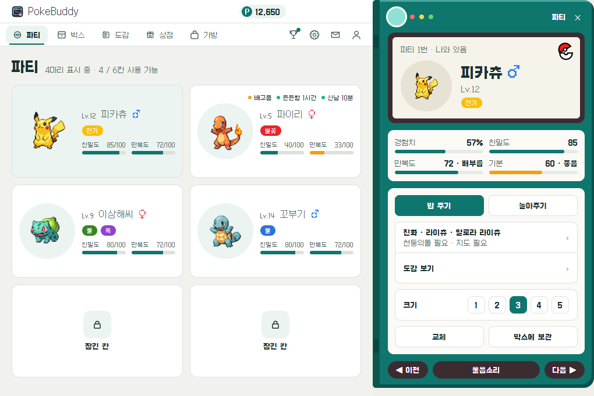
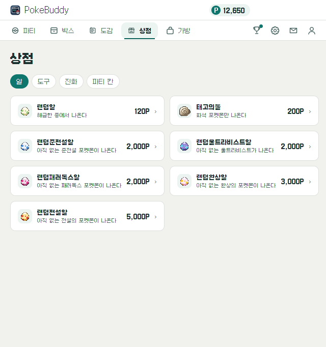

# pokebuddy

**바탕화면에서 포켓몬을 키우는 방치형 게임**

일하는 동안 포켓몬이 창 위를 걸어 다닌다. 가끔 밥을 주고 놀아 주면 된다.

[다운로드](#다운로드) · [게임 방법](#게임-방법) · [설명서](docs/guide.md)

<!-- 이미지 [hero]: 바탕화면 위에서 포켓몬 여러 마리가 돌아다니는 GIF — docs/images/README.md -->

---

## 다운로드

[최신 릴리스](https://github.com/MilkLotion/pokebuddy/releases/latest)에서 받는다.

| 컴퓨터 | 파일 |
|---|---|
| Windows | `pokebuddy-Setup-<버전>.exe` |
| Mac (Apple Silicon) | `PokeBuddy-<버전>-arm64.dmg` |
| Mac (Intel) | `PokeBuddy-<버전>-x64.dmg` |

코드 서명이 없어서 처음 한 번은 경고가 뜬다.
Windows 는 `추가 정보` 를 누른 뒤 `실행` 을 누른다.
Mac 은 시스템 설정의 개인정보 보호 및 보안에서 `그래도 열기` 를 누른다. 키체인 허용 창이 뜨면 `항상 허용` 을 고른다.

새 버전은 앱이 켜진 채로 받는다. 설치와 제거는 [설명서](docs/guide.md#설치)에 자세히 있다.

## 게임 방법

처음 켜면 역대 스타터 27종과 피츄, 이브이 가운데 한 마리를 고른다.
고른 포켓몬은 화면 위를 걸어 다닌다. 한동안 입력이 없으면 잠든다. 누르면 울고 끌어 올리면 버둥거린다.

돌봄은 우클릭 메뉴의 밥 주기와 놀아주기 두 가지다. 배가 고프면 말풍선이 뜬다. 무시해도 친밀도는 깎이지 않는다. 배고픈 동안 덜 오를 뿐이다.

파티에 있는 포켓몬은 시간이 지나면 포인트를 모은다. 친밀도가 높을수록 빨리 모은다. 바탕화면에 나와 있으면 가끔 포인트나 도구를 주워 오기도 한다.
포인트로 상점에서 알을 산다. 알은 돌보미집에서 준비 시간을 채운 뒤 직접 연다.

경험사탕으로 레벨을 올린다. 진화 조건을 채우면 알림이 오고, 진화는 직접 누른다. 진화의돌·연결의끈·지도 같은 도구도 상점에 있다.

파티는 2칸에서 시작해 6칸까지 늘어난다. 나머지 포켓몬은 박스에 둔다.

게임 시간은 앱이 떠 있을 때만 흐른다. PC 를 잠그거나 앱을 끄면 멈춘다. 배틀은 없다.

## 설정창

트레이 아이콘(Mac 은 메뉴 막대) 메뉴에서 `설정창 열기` 를 누른다.

| 탭 | 하는 일 |
|---|---|
| 파티 | 여섯 칸. 칸을 누르면 옆에 상세 창이 열린다 |
| 박스 | 파티 밖 포켓몬과 돌보미집 |
| 도감 | 종마다 얻는 방법과 진화 조건 |
| 상점 | 알, 포켓몬, 도구, 진화 도구, 파티 칸 |
| 가방 | 산 도구 쓰기 |
| 교환 | 친구와 한 마리씩 바꾸기 |

업적, 설정, 우편함, 계정은 헤더에 있다. 처음 쓰는 기능은 튜토리얼이 짚어 준다.

## 교환, 계정, AI 도구 연결

설정창 박스 탭의 메뉴 단추에서 `교환`을 골라 교환 모달을 열고 링크를 만들어 친구에게 보내면 포켓몬을 한 마리씩 바꾼다. 로그인은 필요 없다.

로그인은 선택이다. 로그인하면 저장 사본이 서버에 올라가고 우편함 선물을 받는다.

Claude Code, Codex CLI, Gemini CLI 를 쓴다면 사용자 → `연결` 탭에서 연결해 둔다.
맨 앞 터미널에서 AI 가 일하면 포켓몬도 바쁘게 움직인다. 승인을 기다리면 두리번거리고, 도구가 실패하면 쓰러진다.
AI 가 일하는 동안에는 친밀도와 포인트가 두 배로 쌓인다. 연결하려면 Node.js 가 있어야 한다.

<!-- 이미지 [cli-state]: 터미널에서 AI 가 일하는 동안 포켓몬이 작업 동작을 하는 GIF — docs/images/README.md -->

## 문서

| 문서 | 내용 |
|---|---|
| [설명서](docs/guide.md) | 설치, 게임 방법, 설정, 문제 해결 |
| [개발과 배포](docs/contributing/development.md) | 저장소에서 실행하기, CLI 명령, 빌드와 릴리스 |
| [문서 안내](docs/README.md) | 설계, 게임 규칙, 용어 |

## 라이선스

코드는 [MIT](LICENSE) 다.

pokebuddy 는 팬이 만든 비공식 앱이다. Nintendo · Creatures Inc. · GAME FREAK inc. · The Pokémon Company 와 제휴하지 않았다. 승인이나 후원도 받지 않았다.
포켓몬과 포켓몬 캐릭터의 권리는 Nintendo · Creatures Inc. · GAME FREAK inc. 에 있다. MIT 라이선스는 이 저장소의 코드에만 적용한다.

- 무료다. 개인 · 비상업 팬 용도로만 쓴다. 후원을 받지 않고 유료 기능도 없다.
- 이 앱을 돈을 받고 파는 곳은 이 프로젝트와 관계가 없다.
- 권리자가 요청하면 그림 받기와 배포를 멈춘다. 요청은 [이슈](https://github.com/MilkLotion/pokebuddy/issues)로 받는다.
- 포켓몬 그림 파일은 저장소와 설치 파일에 없다. 처음 실행할 때 받아서 내 컴퓨터에만 캐시한다.
- 저장소에 있는 그림은 로고, 이 프로젝트가 그린 도구 아이콘(`assets/items`), 문서의 화면 캡처다. 화면 캡처에는 포켓몬 그림이 보인다.

### 그림 출처

- 움직이는 그림: [PMDCollab/SpriteCollab](https://github.com/PMDCollab/SpriteCollab). 기여자들의 작품은 CC BY-NC 4.0 이다. 일부는 원작 게임에서 온 그림이고 제작자 표기가 `CHUNSOFT` 다. 제작자는 포켓몬마다 다르다. [SpriteCollab 사이트](https://sprites.pmdcollab.org)에서 포켓몬별 제작자를 본다.
- PMDCollab 에 그림이 없는 종의 걷는 그림: [rh-hideout/pokeemerald-expansion](https://github.com/rh-hideout/pokeemerald-expansion)(RHH)의 따라다니기 그림. 9세대 그림은 [DarkusShadow 의 묶음](https://www.deviantart.com/darkusshadow/art/Gen-9-Paldea-Pokemon-Overworld-Sprites-967776690)에서 왔고 제작자는 Darkus_Shadow · Princess-Phoenix · shaderr31 · Molfang62 · CarmaNekko · EduarPokeN · Larryturbo · TyranitarDark · Anarlaurendil 이다. 그림 저작권은 Nintendo · Creatures · GAME FREAK 에 있다.
- 초상·도구·알 그림: [PokeAPI sprites](https://github.com/PokeAPI/sprites)(저장소 CC0). PokeAPI 에 없는 경험사탕·민트·일부 진화 도구는 [msikma/pokesprite](https://github.com/msikma/pokesprite)(코드 MIT). 그림 저작권은 Nintendo · Creatures · GAME FREAK 에 있다.
- 글꼴: [Galmuri](https://github.com/quiple/galmuri)(© Lee Minseo), SIL Open Font License 1.1. 전문은 [assets/fonts/OFL.txt](assets/fonts/OFL.txt).

제작자 표시가 빠졌거나 틀렸으면 [이슈](https://github.com/MilkLotion/pokebuddy/issues)로 알려 주면 고친다.
