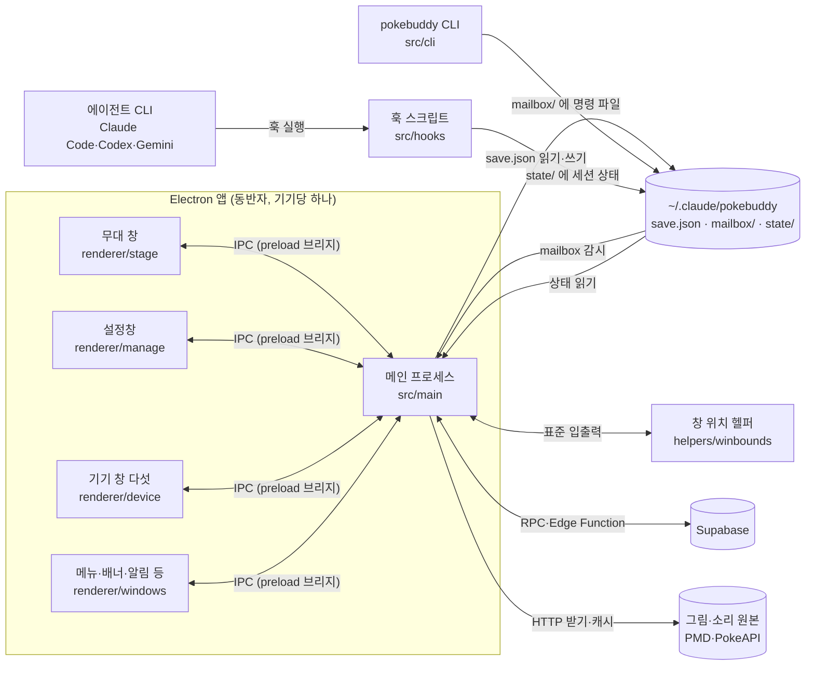
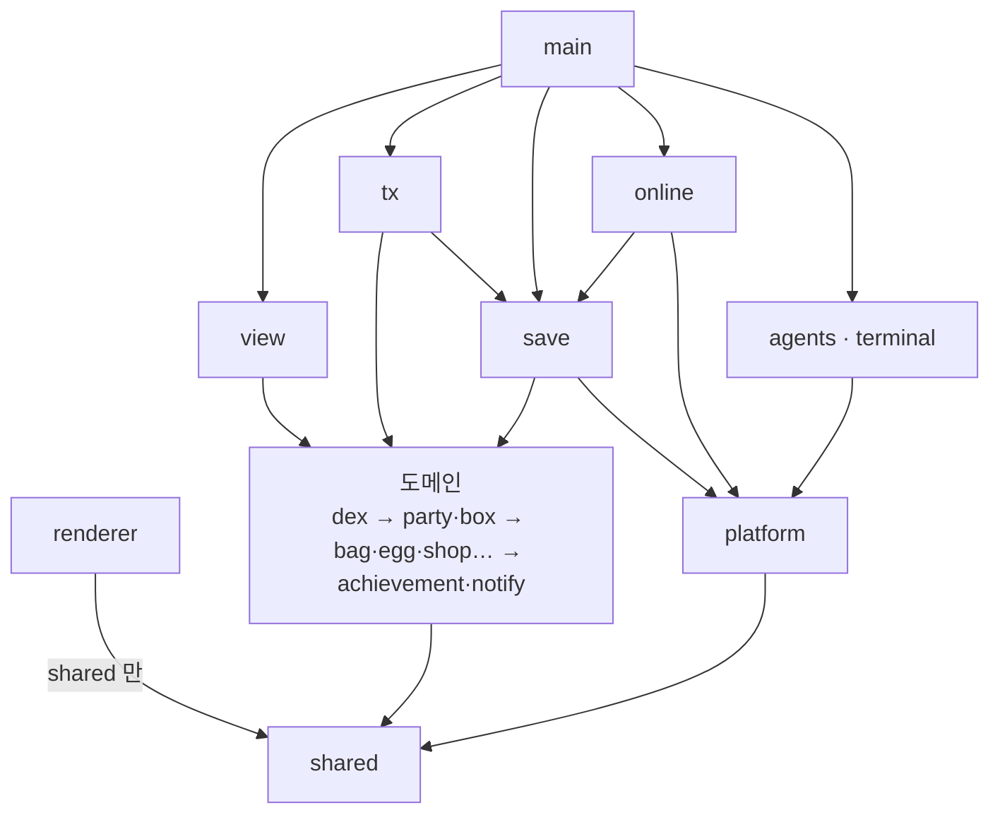

# 코드 지도

새 기능을 넣거나 고치기 전에 읽는 문서다. 폴더마다 무엇을 넣는 곳인지와 대표 파일만 적었으니, 나머지는 이름으로 검색한다. 마지막 절 [공통 코드](#공통-코드)는 같은 기능이 같은 동작을 하도록 이미 모아 둔 코드다. 비슷한 화면이나 동작을 새로 만들기 전에 거기서 먼저 찾는다.

## 한눈에

pokebuddy 는 바탕화면에 포켓몬을 띄워 두는 Electron 앱이다. 포켓몬은 무대 창 위를 걸어 다니고, 사용자가 쓰는 에이전트 CLI(Claude Code, Codex, Gemini)가 일하는 동안 그 상태에 맞춰 움직인다. 돌보기, 상점, 도감, 박스 같은 게임 기능은 설정창과 그 옆에 붙는 기기 창에서 다룬다. 게임 상태는 기기마다 암호화한 `save.json` 하나에 있고, 계정·클라우드 저장·친구 교환은 Supabase 서버를 쓴다.

코드는 크게 세 덩어리다.

- **앱 껍질** — `main/`(Electron 메인 프로세스)과 `renderer/`(창 화면). 창을 띄우고 그리기만 하고, 게임 규칙은 갖지 않는다.
- **게임 코어** — 도메인 폴더(`dex/`, `party/`, `shop/` …)에 규칙이 있고, `tx/` 가 명령을 저장 변경으로 바꾸며, `view/` 가 저장을 화면 모델로 바꾼다.
- **바깥과 잇는 코드** — `save/`(파일), `online/`(서버), `agents/`·`terminal/`·`hooks/`(에이전트 CLI와 터미널), `cli/`(`pokebuddy` 명령).

## 프로세스와 통로

- 앱 안에서 디스크, 서버, 헬퍼에 닿는 것은 메인 프로세스뿐이다. 창은 preload 가 연 IPC 브리지(`window.pokebuddy*`)만 쓰고, preload 는 창마다 그 창에 필요한 브리지만 내놓는다.
- 동반자가 둘 이상 뜨면 잠금(`save.lock`)을 쥔 하나만 `save.json` 을 쓴다(writer). 나머지와 `pokebuddy` CLI 는 명령을 `mailbox/` 에 파일로 넣고, writer 가 받아 처리한 뒤 결과 파일을 남긴다.
- 훅 스크립트는 앱 코드를 import 하지 않는다. 컴파일된 파일을 `~/.claude/scripts/hooks/` 로 복사해 에이전트 CLI 가 `node` 로 실행하고, 세션별 상태를 `state/` 에 적기만 한다.
- 창 위치 헬퍼는 맨 앞 터미널 창을 알아내는 외부 프로그램이다(Windows 는 `winbounds.ps1`). 메인이 띄워 두고 한 줄씩 묻는다.

## 층과 의존 규칙

화살표는 import 방향이다. 위에서 아래로만 import 하고, 이 규칙은 `src/tools/check/check-deps.ts` 의 `LAYERS` 가 검사한다(자체 검사 첫 번째 항목). 꼭 알아야 할 금지 사항은 아래와 같다.

- **renderer 는 `shared` 말고 아무것도 import 하지 않는다.** 그것도 대부분 `import type` 이고, 값으로 쓰는 것은 문구·숫자 글자(`fail-text`, `count-text`, `josa`)와 메인과 같이 쓰는 몇 가지 값(`features`, `window-metrics`, `live-keys`, `device-busy`, `account-rules`)뿐이다. 화면에 필요한 값은 메인이 만들어 IPC 로 보낸다.
- **도메인은 파일을 읽고 쓰지 않는다.** 앱에 든 읽기 전용 자료는 로더 세 곳에서만 읽는다: `dex/data.ts`(`data/*.json`), `view/i18n.ts`(문구), `view/name-table.ts`(종 이름).
- **도메인끼리는 같은 단이나 아래 단만 import 한다.** 아래부터 `dex` → `party`·`box` → `bag`·`egg`·`shop`·`state`·`find`·`mail`·`tutorial`·`trade`·`motion` → `achievement`·`notify` 다.
- **`electron` 은 `main/` 만 값으로 import 한다.** 예외는 설치 때 Electron 을 받는 `cli/setup.ts` 하나다.
- **앱 코드는 `tools/` 를 import 하지 않는다.** `verify/` 는 반대로 아무것도 import 하지 않는다. 서버 함수로 복사되는 파일이기 때문이다.

정적 검사 `check-deps`·`check-names` 의 예외 목록은 비어 있다. 예외를 늘려 통과시키지 않고 코드를 규칙에 맞춘다.

## 폴더 지도

### 앱 껍질

#### `src/main/` — Electron 메인 프로세스

앱을 켜고, 창을 띄우고, 게임 코어와 바깥을 잇는다. 루트에는 진입점 `app.ts` 와 `preload.ts` 만 있고, 나머지는 하위 폴더에 일 단위로 나뉜다. `app.ts` 는 부팅 단계를 차례로 부르는 배선만 한다.

- `app/` — 앱 전체에 걸친 것. 부팅 단계(`boot.ts`), 1초 시계(`clock.ts`), 명령 등록과 mailbox 연결(`commands.ts`), 1초 틱마다 하는 일(`ticks.ts`), 두 PC 규칙으로 멈추기(`halt.ts`), 동반자 잠금(`lifetime.ts`), 끄는 순서(`quit.ts`).
- `manage/` — 설정창 하나. 창 만들기와 OS 창 단추 색(`window.ts`), 설정창 요청 처리기(`handlers.ts`), 기기 창 다섯과 오가는 길(`devices.ts`), 받은 값의 모양 검사(`requests.ts`).
- `stage/` — 무대. 화면마다 무대 창과 무대를 한 쌍씩 둔다(`stage-group.ts`). `stage.ts` 가 40ms 마다 프레임을 만들어 `stage-window.ts` 로 보낸다. 맨 앞 터미널을 보고 포켓몬을 보일지 정하는 `host-watch.ts`, 말풍선과 바탕화면 튜토리얼도 여기 있다.
- `windows/` — 창 공용 도구와 작은 창. 보안 옵션과 덮개 창(`options.ts`), 보낸 창 확인과 IPC 연결(`ipc.ts`), 설정창 옆에 붙는 기기 창 틀(`device-window.ts`), 알림 배너(`banner-window.ts`)와 첫 포켓몬 고르기 창.
- `menus/` — 포켓몬 메뉴, 트레이, 메뉴 창. 메뉴 항목은 `view/menus.ts` 가 만든다.
- `services/` — 온라인, 친구 교환, OS 키 저장소, 자동 업데이트를 켜고 끈다. 묶음의 주인은 `registry.ts`.
- `art/` — 포켓몬 그림과 울음소리를 받아 캐시한다. 받을 주소는 `sources.ts` 한 곳이다.
- `update/` — 업데이트 엔진(Windows `updater.ts`, mac `mac-updater.ts`)과 패치노트.

메인은 게임 규칙을 계산하지 않고 화면 문구도 만들지 않는다. 메뉴 항목, 멈춤 창 글자, 배너 문구, 교환 화면 값은 모두 `view/` 가 만든다.

#### `src/renderer/` — 창 화면

HTML 과 그 스크립트다. 메인이 보낸 모델을 DOM 이나 캔버스에 그리고, 사용자 조작은 명령으로 돌려보낸다. 브리지는 `ui/bridge.ts` 의 `needBridge` 로만 받는다. 빌드 결과는 `dist/web/renderer/<폴더>/<이름>.js` 로 나오고, HTML 이 그 경로를 싣는다.

- `manage/` — 설정창(아래 따로).
- `stage/` — 무대 캔버스. 그리기 루프(`stage.ts`), 그림 시트 재생(`sprites.ts`), 끌기·클릭(`pointer.ts`).
- `device/` — 설정창 옆에 붙는 기기 창 다섯(파티 상세, 도감, 상점, 가방, 파티 교체). 공통 틀은 `device-frame.ts`, 상점·가방이 같이 쓰는 화면은 `item-face.ts`.
- `windows/` — 메뉴, 첫 포켓몬 고르기, 놀이공간 그리기, 배너, 알림, 화면 고르기.
- `ui/` — 여러 창이 같이 쓰는 도구. 브리지(`bridge.ts`), 요소 만들기(`dom.ts`), 초상(`portrait.ts`), 코치마크(`coach.ts`), 막대(`fill-bar.ts`), 타입 배지(`type-badge.ts`).
- `styles/` — 창 CSS. 모든 창이 `tokens.css` 를 먼저 읽는다.

#### `src/renderer/manage/` — 설정창

설정창은 탭 다섯, 대화상자, 기기 창 연결 다섯, 튜토리얼로 이루어진다. 이것을 기능마다 한 파일로 나눴고, 진입점 `manage.ts` 는 각 기능을 등록하고 서로 잇는 고리만 건다.

- **뼈대** — `shell.ts` 가 헤더 숫자, 탭 줄, 본문 다시 그리기를 맡고 `registerTab` 으로 탭을 받는다. 모달은 `dialog.ts` 가 하나만 띄우고 `registerDialog` 로 종류를 받는다. 명령 보내기는 `command.ts`, 1초마다 스냅샷 다시 읽기는 `live.ts`, 열기와 바로가기(알림 배너, 포켓몬 메뉴, 교환 링크에서 온 경로)는 `routes.ts`.
- **탭** — `party-tab.ts`, `box-tab.ts`, `dex-tab.ts`, `shop-tab.ts`, `bag-tab.ts`. 탭마다 자기 상태(쪽, 검색어, 고른 칸)를 들고 있다.
- **기기 창 연결** — `pet-link.ts`, `dex-link.ts`, `shop-link.ts`, `bag-link.ts`, `party-link.ts`. 공통 뼈대는 `device-link.ts` 로, 고른 값이나 스냅샷이 바뀔 때만 다시 열고 늦게 온 답은 버린다.
- **대화상자** — 돌보미집(`daycare.ts`), 진화(`evolve.ts`), 메가진화·모습(`pet-forms.ts`), 우편(`mail.ts`), 교환(`trade.ts`), 설정·사용자(`settings.ts`, `account.ts`), 업적, 가이드북(`guide.ts`), 패치노트(`update-notes.ts`), 박스 순서.
- **상태** — 모든 파일이 읽는 기둥 상태(보는 스냅샷, 탭, 열린 모달)는 `state.ts` 의 `ui` 하나다. 여러 파일이 같이 고치는 상태는 따로 묶었다: 옮기기·끌기(`box-state.ts`), 계정(`account-state.ts`), 교환(`trade-state.ts`).
- **튜토리얼** — 문구와 단계 표는 `tutorial-steps.ts`, 코치마크 그리기와 입력 막기, OS 창 단추를 어둡게 하는 신호는 `tutorial.ts`.

게임 규칙은 하나도 여기 두지 않는다. 화면은 스냅샷을 받아 그리고, 조작은 명령으로 보낸 뒤 새 스냅샷을 다시 받는다.

### 게임 코어

#### `src/tx/` — 명령 한 건을 저장 한 번으로 처리한다

게임 상태를 바꾸는 명령은 어디서 왔든(설정창, 메뉴, CLI, 친구 교환) 여기를 지난다. 진입점은 `game.ts` 로, 저장 파일 읽기·쓰기와 실행기, 시간 적용을 한 곳에 묶는다. `dispatcher.ts` 가 명령 이름으로 처리기를 찾고, `executor.ts` 가 저장 사본에 처리기를 실행한다. 그 뒤 `settle.ts` 가 해금, 튜토리얼, 업적 같은 후처리를 이어 붙이고 결과를 한 번에 쓴다. 처리기는 명령 묶음별로 `handlers/` 에 있고, 명령 이름과 처리기는 `command-table.ts` 에서 짝짓는다. 인자 모양은 `args.ts` 가 바로잡는다.

시간도 같은 길을 쓴다. 1초 틱이 `tick.ts` 로 흐른 시간을 적용하면 같은 후처리가 돈다. `live-save.ts` 는 틱 결과를 메모리에 두었다가 15초마다 파일에 쓴다. 같은 요청 ID 는 두 번 실행하지 않는다.

#### `src/view/` — 저장을 화면 모델로 바꾼다

설정창 스냅샷(`snapshot.ts`)과 개체 하나의 화면 값(`pet.ts`), 기기 창 모델(`device-*.ts`), 도감·상점 목록과 상세, 무대가 보는 마리(`party-pet.ts`)를 만든다. 메인이 띄우는 창의 글자도 여기서 만든다: 메뉴 항목(`menus.ts`), 배너(`banner.ts`), 멈춤·안내 창(`halt.ts`), 첫 포켓몬 고르기(`picker.ts`), 우편함(`mail.ts`), 교환 화면(`trade-screen.ts`). 다른 코드는 문구 진입점인 `text.ts` 를 쓴다. 모델의 타입은 `shared/model/` 에 있어서 렌더러도 같은 타입을 본다. `view` 는 저장을 읽기만 한다.

#### 도메인 — 게임 규칙

저장(`SaveV3`)을 받아 계산만 한다. 숫자 규칙은 폴더마다 `rules.ts` 의 `…_RULES` 상수에 있고, 시각과 난수는 부르는 쪽이 넣어 준다(`shared/clock.ts`, `shared/rand.ts`).

| 폴더 | 하는 일 |
|---|---|
| `dex/` | 종, 진화, 모습, 메가진화, 해금. `data/*.json` 로더(`data.ts`)가 여기 있어 거의 모든 폴더가 import 한다. |
| `party/` | 새 개체를 만들어 파티나 박스에 넣는다(`create.ts` 의 `addNewPet`). 개체 자리 찾기(`locate.ts`), 파티 칸, 프리셋, 교환 중 잠금도 여기. |
| `box/` | 박스와 칸. 박스 순서·정렬·이름은 `order.ts`. |
| `bag/` | 도구를 넣고 쓴다. 사탕 미리보기(`preview.ts`)도 여기. |
| `egg/` | 새 알, 부화 추첨, 알 열기. |
| `shop/` | 상품, 가격, 구매, 판매. |
| `state/` | 흐른 시간 적용(`time.ts`), 밥·놀이(`care.ts`), 밥·놀이를 지금 할 수 있는지 판정(`care-block.ts` — 가방 먹이·돌봄 명령·화면 단추가 모두 이것만 본다), 설정 바꾸기(`settings.ts`). |
| `find/` | 1초 틱마다 줍기를 굴리고(`roll.ts`) 주운 것을 넣는다(`pickup.ts`). |
| `mail/` | 우편 선물을 넣고 받은 편지를 기록한다. |
| `tutorial/` | 튜토리얼 시작 조건(`conditions.ts`)과 대기열·다시 보기(`queue.ts`). |
| `trade/` | 친구 교환의 로컬 규칙. 서버 쪽은 `online/` 에 있다. |
| `motion/` | 무대에서 마리 하나가 걷고 자고 반응하는 판단(`brain.ts`). |
| `achievement/` | 업적 정의, 진행도, 달성, 보상 받기. |
| `notify/` | 알 준비·진화 가능 같은 알림을 줄 세운다. |

### 바깥과 잇는 코드

#### `src/save/` — 저장 파일

`save.json` 을 읽고 쓰는 코드는 `save-file.ts` 에만 있다. 읽을 때 암호를 풀고(`crypt.ts`) 모양을 바로잡는다(`normalize.ts`). 저장 형식에 칸을 더하면 `normalize.ts` 도 같이 고친다. writer 잠금과 파일 감시는 `save-watch.ts`, `mailbox/` 명령 파일은 `command-channel.ts` 가 맡는다.

#### `src/online/` — 서버

계정, 클라우드 저장, 우편함, 친구 교환의 서버 쪽이다. 서버 호출은 `server-call.ts` 의 `callRpc` 를 거치고, 실패는 `codes.ts` 가 오류 코드로 바꾼다. `cloud.ts` 는 두 PC 에서 같은 저장을 쓸 때의 상태 기계다.

#### `src/agents/`, `src/terminal/`, `src/hooks/` — 에이전트 CLI 와 터미널

`agents/` 는 에이전트 CLI 설정 파일에 훅을 등록하고 지운다. `hooks/pokebuddy-state.ts` 는 그렇게 등록된 훅 스크립트로, 혼자 실행되므로 `shared` 의 타입만 import 한다. `terminal/` 은 창 위치 헬퍼에게 맨 앞 창을 묻고 어느 세션을 볼지 정한다.

#### `src/cli/` — `pokebuddy` 명령

`bin/pokebuddy` 는 Node 판 확인과 도움말만 하고 `main.ts` 의 `runCli` 로 넘긴다. 게임 명령은 직접 실행하지 않고 `mailbox/` 로 writer 에게 넘긴다.

### 바닥

#### `src/shared/` — 메인, 렌더러, 훅이 같이 읽는 코드

렌더러도 읽기 때문에 Node API 와 `electron` 을 쓰지 않는다. `ipc/` 는 창마다 채널 계약(타입만)이고, preload 의 채널 표와 처리기가 이 계약에 묶여 있어 채널이 빠지거나 인자가 틀리면 컴파일이 안 된다. `model/` 은 화면 모델 타입, `names/` 는 명령 이름과 거절 사유 같은 이름 목록이다. 루트에는 저장 형식(`save-v3.ts`), 실패 문구(`fail-text.ts`), 숫자·시간 글자(`count-text.ts`), 조사 고르기(`josa.ts`)가 있다.

#### `src/platform/` — Node 공용 도구

원자적 쓰기, 경로, 사용자 설정, pid 잠금, 폴더 감시, PNG·ZIP 읽기. 게임 규칙과 `electron` 을 모른다.

### 따로 도는 코드

- `src/verify/save-rules.ts` — 서버가 저장을 받을 때 불가능한 변화를 찾는 규칙.
- `src/tools/` — 시험과 개발 도구. `selftest/`(자체 검사), `check/`(정적 검사), `smoke/`(창 화면 검사), `e2e/`, `dev/`(창 하나만 띄워 보기, 시험 계정), `data/`(`data/*.json` 생성), `harness/`(시험 공용 틀과 장면).

## 큰 흐름

### 설정창 단추 → 저장 → 다시 그리기

1. 렌더러 `manage/command.ts` 의 `sendCommand` 가 명령을 보낸다. 처리 중에는 다시 누를 수 없고, 늦어지면 단추가 처리 중 모양이 된다.
2. 메인 `manage/handlers.ts` 가 요청 모양을 확인하고 흐른 시간을 먼저 적용한다.
3. `app/commands.ts` 의 디스패처가 writer 가 아니면 명령을 `mailbox/` 로 넘긴다.
4. `tx/game.ts` → `tx/executor.ts` 가 저장을 읽고, 처리기가 도메인 함수를 부르고, `settle.ts` 후처리를 거쳐 한 번 쓴다.
5. 답이 돌아오면 렌더러는 실패 시 `shared/fail-text.ts` 문구를 띄우고, 성공 시 스냅샷을 다시 받아 그린다.

### 저장 → 화면

1. 렌더러 `manage/live.ts` 가 스냅샷을 부르면 메인이 `view/snapshot.ts` 로 만들어 돌려준다. `shell.ts` 가 지금 탭을 다시 그린다.
2. 1초마다 다시 받은 스냅샷에서 시간으로만 바뀌는 필드(`shared/live-keys.ts`)만 달라졌으면 막대와 남은 시간 글자만 고치고, 아니면 다시 그린다.
3. 기기 창은 설정창의 연결 파일이 연다. 메인 `manage/devices.ts` 가 `view/device-*.ts` 로 모델을 만들고, 기기 창은 새 모델이 올 때마다 통째로 다시 그린다.

## 어디에 넣나

| 하려는 일 | 손댈 곳 |
|---|---|
| 게임 명령 추가 | `shared/names/commands.ts` 에 이름, 도메인에 규칙, `tx/handlers/` 에 처리기, `tx/command-table.ts` 에 짝, `tx/args.ts` 에 인자 |
| 규칙 숫자 바꾸기 | 그 도메인의 `rules.ts` |
| 저장에 칸 추가 | `shared/save-v3.ts`, `save/normalize.ts`, 서버 검증이 걸리면 `verify/save-rules.ts` |
| 설정창 화면 고치기 | 모델은 `view/snapshot.ts`·`view/pet.ts`, 타입은 `shared/model/`, 그리기는 `renderer/manage/` 의 그 탭이나 대화상자 파일 |
| 설정창에 대화상자 추가 | `renderer/manage/<이름>.ts` 를 만들고 `manage.ts` 에서 `registerDialog`, 종류는 `dialog-types.ts` |
| 새 창 | `renderer/<묶음>/` 와 HTML, `shared/ipc/` 계약, `main/windows/` 창 파일, `main/preload.ts` 채널 표 |
| 서버 호출 추가 | `online/` 에서 `callRpc` 로, 오류 코드는 `online/codes.ts` 와 `shared/names/online-codes.ts` |

## 공통 코드

같은 기능은 같은 동작을 해야 한다. 공통 코드를 둔 이유가 그것이다. 비슷한 화면이나 동작을 만들 때는 아래 코드를 먼저 쓰고, 창마다 따로 만들지 않는다. 공통 코드와 다르게 동작해야 하면 따로 만들지 말고 공통 코드에 선택지를 더한다. 그 차이가 규칙(`docs/specs/`)에 있는지 먼저 확인하고, 없으면 규칙부터 정한다.

### 설정창

- **모달** — `dialog.ts` 의 `registerDialog`·`openAnyDialog`·`closeDialog`. 머리 줄은 `dialogHead`, 바닥 단추 줄은 `actionsRowEl`·`actionButtonEl`·`closeButton`, ✕ 는 `widgets.ts` 의 `dialogCloseEl`. 실패 문구는 바닥 단추 줄의 빈자리에 `drawDialog` 가 넣으므로 모달이 따로 그리지 않는다.
- **2단 모달** — 왼쪽 목록과 오른쪽 내용. 패치노트와 가이드북이 같은 틀이다(`update-notes.ts` 의 `notesHead`, CSS `notes-body`·`notes-list`·`notes-item`·`notes-detail`, 묶음 제목은 `guide-group`).
- **가림막과 OS 창 단추** — 가림막은 `setScrim` 이 켜고 끈다. OS 가 그리는 창 단추 자리는 `tutorial.ts` 가 헤더를 덮은 막의 겹수(0·1·2)를 메인에 보내고, 메인 `manage/window.ts` 가 같은 겹수 색으로 칠한다. 막을 새로 겹치는 화면을 만들면 이 겹수 계산에 넣는다.
- **헤더 아이콘의 열림 표시** — `registerDialog` 의 `headerButton` 으로 건다. 표시는 `setScrim` 이 맞춘다.
- **명령** — `command.ts` 의 `sendCommand`. 처리 중 모양은 `setBusy`·`whenSlow`, 실패 문구는 `shared/fail-text.ts` 의 `failTextOf`.
- **작은 부품** — `widgets.ts` 의 `chipsEl`(분류 칩), `pageHeadEl`(탭 머리), `switchEl`·`segmentedEl`·`settingRow`(설정 줄), `alertEl`(이어지는 상태 안내), `meterEl`. 격자 쪽 넘김과 보기 바꾸기는 `grid-view.ts`.
- **검색 칸** — `search.ts` 의 `findBarEl`(찾기 줄). 박스 찾기·도감·상점이 같이 쓴다. 입력을 멈추고 1초 뒤나 Enter 로 검색하고, `✕` 로 지운다. 이전·다음 결과가 필요하면 `nav` 를 켠다(박스). CSS 는 `widgets.css` `.find-bar` 다.
- **튜토리얼** — 문구는 `tutorial-steps.ts` 의 표에 더하고, 그리기·입력 막기는 `tutorial.ts` 가 한다. 다시 보기는 `tutorial/queue.ts` 의 `REPLAYABLE_TUTORIALS` 에 넣는다.

### 기기 창

- **틀** — `device/device-frame.ts` 의 `createDeviceFrame`. 머리·바닥·높이 알림, ←→ 넘기기와 Esc 닫기가 여기 있다. 입력칸 안의 키는 넘기기·닫기에 쓰지 않는다.
- **상품 화면** — 상점과 가방은 `item-face.ts` 의 `drawItemFace` 를 같이 쓴다. 수량은 `qtyRowEl`(`−`·숫자 칸·`+`·`최대`), 미리보기·합계·결과 상자는 `totalBoxEl`(늘 두 줄 높이), 바닥 주 단추는 `goButtonEl`.
- **설정창과의 연결** — `manage/device-link.ts` 의 `createDeviceLink`. 명령을 보내는 동안 중간 장면을 보내지 않으려면 `holding` 을 켠다(상점·가방).

### 여러 창이 같이 쓰는 것

- **코치마크** — `ui/coach.ts` 의 `drawCoachLayer`. 설정창, 파티 상세 기기 창, 무대가 같은 말풍선과 입력 규칙을 쓴다.
- **그림과 표시** — 초상은 `ui/portrait.ts`(`spriteCanvas`, `portraitImg`), 막대는 `ui/fill-bar.ts`, 타입 배지는 `ui/type-badge.ts`, 성별·이로치 아이콘은 `ui/gender-icon.ts`·`ui/shiny-icon.ts`.
- **글자** — 숫자와 포인트, 남은 시간은 `shared/count-text.ts`(`numberText`, `pointText`, `waitText`), 조사는 `shared/josa.ts`. 메인과 `view` 의 문구는 `view/text.ts` 의 `t` 로 `data/i18n/*.json` 에서 읽는다.
- **알림 배너** — 문구와 목적지는 `view/banner.ts` 가 만든다. `route` 가 없는 배너는 `바로가기` 를 두지 않는다.
- **메인의 창** — 보안 옵션은 `main/windows/options.ts`(`webPreferencesOf`, 덮개 창은 `createOverlayWindow`), 기기 창은 `device-window.ts`.

### 시험

- 자체 검사는 `npm run selftest` 다. 서버가 있어야 하는 시험(trade-net 등)은 로컬 `npx supabase functions serve` 를 띄운 뒤 돌린다.
- 시험 저장은 `src/tools/harness/scenes.ts` 의 장면으로 만든다. 시험 계정은 `npm run dev:account` 로 띄운다([개발과 릴리스](development.md)).
