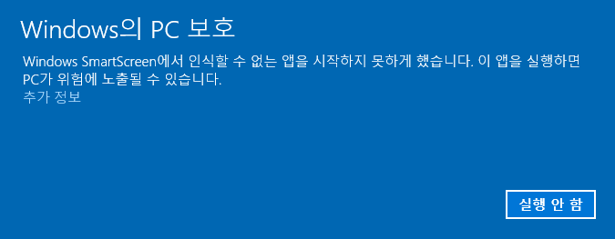

# pokebuddy 설명서

이 문서는 설치 파일로 pokebuddy 를 쓰는 사람을 위한 설명서다. 설치, 게임 방법, 설정, 문제 해결을 적는다.

- 저장소에서 실행하는 방법, CLI 명령, 빌드와 릴리스는 [개발과 배포](contributing/development.md)에 있다.
- 포켓몬의 움직임과 CLI 상태 연동의 원리는 [동반자 동작](specs/companion.md)에 있다.
- 게임 규칙은 [게임 규칙](specs/game.md)을, 가격과 확률은 [밸런스 수치](specs/balance.md)를 따른다.
- 화면 명칭은 [용어사전](terms.md)을 따른다.

## 설치

[최신 릴리스](https://github.com/MilkLotion/pokebuddy/releases/latest)에서 설치 파일을 받는다. Node.js 는 필요 없다.
모든 설치본은 같은 저장 폴더(`~/.claude/pokebuddy`)를 쓴다. 앱을 지웠다 다시 깔아도 파티와 포인트가 남는다.

### Windows

`pokebuddy-Setup-<버전>.exe` 를 실행한다.

- 코드 서명이 없다. 처음 실행하면 "Windows의 PC 보호" 창이 뜬다. `추가 정보` 를 누른 뒤 `실행` 을 누른다.
- 묻지 않고 바로 설치한다. 설치 위치는 `%LOCALAPPDATA%\Programs\pokebuddy` 다. 관리자 권한이 필요 없다.
- 설치가 끝나면 앱이 뜬다. 처음이면 첫 포켓몬 선택 창이 뜬다.
- 시작 메뉴와 바탕화면에 바로가기를 만든다.
- 앱이 떠 있을 때 바로가기를 다시 누르면 설정창을 연다.
- 작업 표시줄 아이콘을 우클릭하면 파티 포켓몬마다 밥 주기와 놀아주기가 보인다.

<!-- 이미지 [install-windows-run]: `추가 정보` 를 누른 뒤 `실행` 단추가 보이는 SmartScreen 창 — images/README.md -->

### Mac

Apple Silicon 은 `PokeBuddy-<버전>-arm64.dmg`, Intel 은 `PokeBuddy-<버전>-x64.dmg` 를 연다.

- `PokeBuddy` 를 `Applications` 로 끌어 넣는다.
- Apple 공증이 없다. 처음 열면 "Apple 이 확인할 수 없음" 경고가 뜬다. 시스템 설정 → 개인정보 보호 및 보안 → 아래의 `그래도 열기` 를 누른다.
- 경고 대신 "손상되었기 때문에 열 수 없습니다"가 뜨면 터미널에서 `xattr -dr com.apple.quarantine /Applications/PokeBuddy.app` 을 실행한 뒤 다시 연다.
- 계정·교환 로그인 정보는 키체인 키 `PokeBuddy Safe Storage` 로 암호화한다. 0.9.0 이하에서 올라오면 이 키의 허용 창이 한 번 뜬다. 로그인 암호를 넣고 `항상 허용` 을 누른다. 그 뒤 업데이트에서는 다시 묻지 않는다.
- 앱은 Dock 에 남지 않는다. 메뉴 막대 아이콘으로 있다.
- 앱이 떠 있을 때 앱을 다시 열면 설정창을 연다.

<!-- 이미지 [install-mac-open-anyway]: 시스템 설정 → 개인정보 보호 및 보안의 `그래도 열기` 단추 — images/README.md -->
<!-- 이미지 [install-mac-keychain]: `PokeBuddy Safe Storage` 키체인 허용 창 — images/README.md -->

### 업데이트

- 앱이 켜진 채로 새 버전을 받는다. 켠 뒤 1분, 그 뒤 6시간마다 확인한다.
- 다 받으면 설정 모달 아래에 "새 버전 준비됨"과 `다시 시작` 이 뜬다. 누르지 않아도 앱을 끌 때 적용한다.
- Mac 앱이 앱 폴더에 쓸 수 없으면(dmg 안에서 바로 실행 등) 새 버전을 받지 못한다. 이때는 `새 버전 <버전>` 과 `받기` 가 뜬다. `받기` 는 새 dmg 를 연다.
- 설정 모달 아래의 `패치노트` 에서 버전마다 바뀐 것을 본다. 업데이트한 뒤 설정창을 처음 열면 그 버전의 패치노트가 한 번 뜬다.
- Windows 0.6.0 이하는 0.7.0 설치 파일을 한 번 손으로 실행해야 한다. Mac 0.8.0 이하는 0.9.0 dmg 로 한 번 덮어 설치해야 한다.

### 끄기와 제거

- 끄기는 트레이(Mac 은 메뉴 막대) 아이콘 메뉴의 `종료` 로 한다.
- 설정의 `로그인 시 시작` 이 켜져 있으면 컴퓨터에 로그인할 때 함께 뜬다. 기본값은 켜짐이다.
- Windows 는 Windows 설정의 앱 목록에서 제거한다. Mac 은 `Applications` 의 `PokeBuddy` 를 휴지통으로 옮긴다.
- 제거해도 저장 폴더(`~/.claude/pokebuddy`)는 남는다. 완전히 지우려면 이 폴더를 직접 지운다.

## 처음 시작하기

1. 첫 포켓몬 선택 창에서 함께할 포켓몬을 고른다. 후보는 역대 스타터 27종과 피츄, 이브이다.
2. 시작 포인트를 한 번 받는다.
3. 고른 포켓몬이 놀이공간에 나온다. 첫 돌봄 튜토리얼이 밥 주기와 놀아주기를 짚어 준다.

<!-- 이미지 [starter]: 첫 포켓몬 선택 창 — images/README.md -->

기능을 처음 쓸 때마다 튜토리얼이 그 자리를 짚어 준다.

- 성장·포인트·파티·가방·진화 튜토리얼은 그 기능이 열릴 때 나온다.
- 도감·교환·사용자 튜토리얼은 그 화면을 처음 열 때 나온다.
- `✕` 로 닫으면 다시 나오지 않는다. 사용법은 설정의 `가이드북` 에서 다시 본다.

## 놀이공간과 포켓몬

포켓몬은 놀이공간 안에서 논다. 앱 창은 테두리 없는 투명 창이고 항상 다른 창 위에 보인다.
포켓몬이 없는 곳을 누르면 뒤의 창이 눌린다.

- 가끔 걷고 두리번거린다. 입력이 없으면 잠든다. 잠드는 시간은 설정의 `잠들기 기준` 으로 정한다(기본 5분).
- 콕 누르면 반응하고 울음소리를 낸다.
- 끌어서 옮길 수 있다. 놓은 자리가 그 포켓몬의 집이 된다. 들고 있는 동안에는 버둥거린다.
- 바탕화면에 나와 있는 포켓몬은 가끔 포인트·도구·진화용 도구·포켓몬을 주워 온다.
- 파티의 포켓몬 가운데 꺼내 둔 마리(최대 6마리)가 함께 나온다. `볼에 넣기` 를 하면 파티에 남은 채로 바탕화면에서만 사라진다.

놀이공간은 설정 → `화면` 탭에서 고른다.

| 방식 | 뜻 |
|---|---|
| `모든 화면` | 모니터마다 포켓몬이 나뉘어 논다. 다른 모니터로 끌어다 놓으면 그 모니터로 옮겨 간다 |
| `한 화면` | 고른 모니터 하나에서 논다. 기본은 주 모니터다 |
| `영역 지정` | 드래그로 그린 사각형 안에서 논다 |

<!-- 이미지 [playground]: 설정 모달 `화면` 탭의 놀이공간 전환 단추 — images/README.md -->

### 메뉴

포켓몬을 우클릭하면 그 포켓몬의 메뉴가 열린다. 맨 위에 `이름 · 성격` 과 상태 두 줄이 있고, 그 아래에 밥 주기, 놀아주기, 볼에 넣기, 상세 보기가 있다.
지금 못 하는 항목은 흐리게 보인다. 오른쪽에 이유나 남은 시간이 나온다.

트레이 메뉴에는 설정창 열기, 잠시 숨기기, 고스트 모드, 종료가 있다. Windows 에서는 트레이 아이콘을 왼쪽 클릭해도 설정창이 열린다.

고스트 모드를 켜면 포켓몬 위를 눌러도 뒤의 창이 눌린다. 그동안 포켓몬을 옮기거나 만지지 못하고 우클릭도 안 된다. 끌 때는 트레이 메뉴나 설정을 쓴다.

<!-- 이미지 [care-menu]: 포켓몬 우클릭 메뉴 — images/README.md -->

## 돌봄

포켓몬마다 만복도, 기분, 친밀도가 있다. 친밀도는 함께 켜 두는 시간과 돌봄으로 오르고 줄지 않는다.

밥은 기본먹이를 준다. 무료이고 개수 제한이 없지만 만복도를 조금만 채운다. 상점의 프리미엄먹이는 만복도를 가득 채우고, 한동안 친밀도가 더 빨리 오르게 한다.

놀아 주면 포켓몬이 잠깐 커서를 따라온다. 놀아주기를 두 번 이어 가면 들뜸, 세 번이면 신남 버프가 켜진다. 다음 놀아주기는 쿨타임이 끝난 뒤, 놀아준 지 20분이 지나기 전에 해야 이어진다. 가방의 장난감을 쓰면 신남이 바로 켜진다. 프리미엄먹이를 먹이면 든든함 버프가 켜진다.

밥 주기와 놀아주기의 쿨타임은 포켓몬마다 따로 센다.

만복도가 낮아지면 포켓몬이 말풍선을 띄운다. 배가 고픈 동안에는 친밀도가 덜 오른다. 그 밖에 불이익은 없으니 돌볼 때는 직접 정한다.

수치는 [밸런스 수치](specs/balance.md)에 있다.

## 포인트와 상점

- 파티에 있는 포켓몬이 시간에 따라 포인트를 모은다. 친밀도가 높을수록 빨리 모은다. 볼에 넣은 파티 포켓몬도 모은다. 박스의 포켓몬은 모으지 않는다.
- 상점은 `알`·`포켓몬`·`도구`·`진화`·`파티 칸` 으로 나뉜다. 산 도구는 가방에 들어간다.
- 가방에서 도구를 골라 대상 포켓몬에게 쓴다.
- 바탕화면에 나와 있는 포켓몬은 가끔 포인트·도구·진화용 도구·포켓몬을 주워 온다. 주우면 `줍기` 알림 배너가 뜬다. 규칙은 [줍기](specs/game.md#줍기)에 있다.

<!-- 이미지 [shop]: 상점 탭 알 분류 — images/README.md -->

## 알과 부화

1. 상점에서 알을 산다. 알은 박스 탭의 돌보미집에 들어간다. 돌보미집에는 알을 6개까지 둔다.
2. 알마다 준비 시간이 따로 흐른다. 준비가 끝나면 알림 배너가 뜬다.
3. 돌보미집에서 알을 직접 연다. 부화 결과 창이 태어난 포켓몬과 들어간 자리를 보여 준다.
4. 파티에 빈 칸이 있으면 파티에 들어가 바로 나온다. 빈 칸이 없으면 박스에 들어간다.

알에서 나오는 종과 확률은 상점에서 구매 전에 확인한다.

<!-- 이미지 [hatch]: 부화 결과 창 — images/README.md -->

## 성장과 진화

- 경험사탕(XS~XL)과 이상한사탕으로 레벨을 올린다. 최대 레벨은 100이다.
- 진화 조건을 채우면 알림 배너가 뜬다. 진화는 파티 상세 기기 창에서 직접 한다. 자동으로 진화하지 않는다.
- 돌로 진화하는 종은 진화의돌을, 교환으로 진화하는 종은 `연결의끈` 을 쓴다.
- 성격은 25종이다. 민트를 쓰면 다른 성격으로 바꾼다.
- 이로치 포켓몬도 있다.

파티나 박스의 포켓몬을 누르면 설정창 옆에 파티 상세 기기 창이 붙어 열린다. 돌봄·진화·성격 변경·크기·교체를 여기서 한다.
`◀ 이전`·`다음 ▶` 이나 방향키로 다음 포켓몬으로 넘긴다. 같은 포켓몬을 다시 누르거나, 탭을 바꾸거나, Esc 를 누르면 닫힌다.

<!-- 이미지 [evolve]: 파티 상세 기기 창에서 진화를 고르는 화면 — images/README.md -->

## 파티와 박스

- 새 게임의 파티는 2칸이다. 상점의 파티 칸 구매와 파티 칸 업적 보상으로 최대 6칸까지 연다.
- 파티 밖의 포켓몬은 박스에 보관한다. 박스 하나는 30칸이고, 모두 차면 새 박스가 생긴다.
- 파티와 박스의 포켓몬은 한 번에 맞바꿀 수 있다(`교체`).
- 코스모그처럼 모습을 고를 수 있는 포켓몬은 박스 칸에 모습들이 2×2 로 보인다. 칸에 마우스를 올리면 모습을 바꾼다.

## 도감과 업적

- 도감에서 전체 종의 등록 상태, 얻는 방법, 진화 조건을 본다. 해금하지 않은 종은 그림이 보이지 않는다.
- 도감과 상점 포켓몬 탭은 검색 줄 오른쪽의 토글(`‹ ›` 쪽, 위아래 꺾쇠 스크롤)로 보는 방식을 고른다. 쪽 방식은 한 쪽에 15칸씩 보이고 `◀`·`▶` 로 쪽을 넘긴다. 스크롤 방식은 전부 이어서 보이고 스크롤해서 본다. 고른 방식은 탭마다 따로 기억한다.
- 검색 칸에 이름이나 번호를 넣고 Enter 나 `검색` 단추를 누르면 목록을 거른다. 입력하는 동안에는 목록이 바뀌지 않는다. `×` 로 칸을 비우면 전체 목록으로 돌아간다.
- 업적을 달성하면 알림 배너가 뜬다. 배너의 `바로가기` 나 헤더의 업적창에서 보상을 받는다. 보상은 파티 칸이나 포켓몬 한 마리다.

<!-- 이미지 [dex]: 도감 탭 목록 — images/README.md -->

## 친구 교환

1. 교환 탭에서 `공유 채널 만들기` 를 누르고 나온 교환 링크를 친구에게 보낸다.
2. 친구는 그 링크를 열거나, 교환 탭의 `링크로 참가` 에 붙여 넣는다.
3. 두 사람이 한 마리씩 골라 바꾼다.

- 교환에는 로그인이 필요 없다.
- 교환 링크는 한 번 쓰면 끝난다.
- 교환해도 진화하지 않는다. 교환 진화 종은 `연결의끈` 으로 진화한다.

<!-- 이미지 [trade]: 교환 탭 — images/README.md -->

## 계정과 우편함

- 로그인은 선택이다. 헤더의 유저 아이콘 → `계정` 탭에서 아이디+비밀번호 또는 GitHub 으로 로그인한다.
- 로그인하면 저장 사본을 서버에 둔다(클라우드 저장). 게임은 계속 내 컴퓨터에서 돈다.
- 같은 계정은 나중에 켠 컴퓨터 하나만 쓴다.
- 헤더의 봉투 아이콘은 우편함이다. 운영자가 보낸 편지를 읽는다. 선물이 든 편지는 열어서 `받기` 를 누른다. 선물은 로그인한 계정만 받는다.

## 설정

설정은 헤더의 톱니바퀴로 연다.

| 탭 | 항목 |
|---|---|
| `일반` | 잠들기 기준, 언어(한국어·영어), 로그인 시 시작, 소리, 가이드북 |
| `화면` | 포켓몬 표시, 고스트 모드, 놀이공간 |

모달 아래 왼쪽에 지금 버전, 업데이트 상태, `패치노트` 가 있다.

## AI 코딩 도구 연결

Claude Code, Codex CLI, Gemini CLI 를 쓰면 포켓몬이 AI 의 작업 상태에 따라 움직인다. 쓰지 않아도 게임은 전부 된다.

- 헤더의 유저 아이콘 → `연결` 탭에서 CLI 마다 `연결` 을 누른다. `해제` 를 누르면 그 CLI 에서 우리 등록만 지운다.
- 연결하려면 Node.js 가 있어야 한다. 훅을 `node` 로 실행하기 때문이다.
- Codex CLI 는 0.124 이상, Gemini CLI 는 0.26 이상이 필요하다. Codex CLI 0.129 이상은 새 훅을 codex 의 `/hooks` 에서 한 번 승인해야 돈다.
- 맨 앞 창이 터미널이면 그 터미널 앱에서 띄운 CLI 의 상태를 따른다. 브라우저 같은 다른 창을 보면 마지막 상태를 유지한다.
- 연결한 CLI 가 일하는 동안에는 파티 포켓몬의 친밀도와 포인트가 두 배 빠르게 쌓인다. 수치는 [밸런스 수치](specs/balance.md)에 있다.

| 상태 | 언제 | 포켓몬 |
|---|---|---|
| 작업 중 | 프롬프트를 보냄 · 도구를 실행함 | 빠르게 걷고 공격 · 기 모으기 같은 작업 동작을 한다 |
| 승인 대기 | 도구 승인 · 질문에 답하기를 기다림 | 두리번거린다 |
| 인사 | 세션 시작 · 턴 끝 | 잠깐 인사한다 |
| 실패 | 도구나 턴이 실패함 | 쓰러진다 |
| 한가 | 그 밖 | 느리게 산책하고 존다 |

CLI 별 이벤트와 판정 방법은 [동반자 동작](specs/companion.md#cli-llm-상태-연동)에 있다.

<!-- 이미지 [connect]: 사용자 모달 `연결` 탭 — images/README.md -->

## 문제 해결

| 증상 | 확인할 것 |
|---|---|
| Windows 에서 "Windows의 PC 보호" 창이 뜬다 | `추가 정보` → `실행` 을 누른다. 코드 서명이 없어서 뜬다 |
| Mac 에서 "Apple 이 확인할 수 없음"이 뜬다 | 시스템 설정 → 개인정보 보호 및 보안 → `그래도 열기` 를 누른다 |
| Mac 에서 "손상되었기 때문에 열 수 없습니다"가 뜬다 | 터미널에서 `xattr -dr com.apple.quarantine /Applications/PokeBuddy.app` 을 실행한다 |
| 포켓몬이 바탕화면에 나오지 않는다 | 처음 나오는 포켓몬은 그림을 받느라 몇 초 걸린다. 인터넷 연결을 확인한다. 그림을 못 받은 포켓몬은 나오지 않는다. 이유는 `~/.claude/pokebuddy/last-error.json` 에 남는다 |
| 포켓몬을 옮기거나 누를 수 없다 | 고스트 모드가 켜져 있는지 트레이 메뉴에서 확인한다 |
| AI 작업 중인데 포켓몬이 반응하지 않는다 | 사용자 → `연결` 탭에서 그 CLI 가 `연결됨` 인지 확인한다. 그 CLI 를 띄운 터미널 창이 맨 앞에 있어야 한다 |
| Windows 에서 Codex 를 쓰면 콘솔 창이 깜빡인다 | `codex --no-daemon` 으로 실행하거나 Codex 연결을 `해제` 한다 |

저장소에서 실행했다면 `pokebuddy status` 가 판정 상태를 한 번에 보여 준다. 방법은 [개발과 배포](contributing/development.md#문제-확인)에 있다.

## 그림과 라이선스

코드는 MIT 라이선스다. 자세한 내용은 [LICENSE](../LICENSE) 를 참고한다.

포켓몬 권리는 Nintendo / Game Freak / Creatures Inc. 에 있다. 이 앱은 개인 용도와 비상업 팬 용도로만 쓴다.
포켓몬 그림은 이 저장소와 설치 파일에 들어 있지 않다. 처음 실행할 때 받아서 `~/.claude/pokebuddy/` 아래에 캐시한다.

- 바탕화면의 움직이는 그림은 [PMDCollab/SpriteCollab](https://github.com/PMDCollab/SpriteCollab) 기여자들의 작품이다. 라이선스는 CC BY-NC 4.0(저작자 표시·비상업)이다. 이 앱으로 만든 화면을 공유할 때는 저작자와 출처를 함께 밝힌다.
- 설정창의 초상·도구·알 그림, 도감 설명, 울음소리는 [PokeAPI](https://github.com/PokeAPI) 에서 받는다. 받는 곳의 상세는 [동반자 동작](specs/companion.md#그림에-대한-메모)에 있다.
